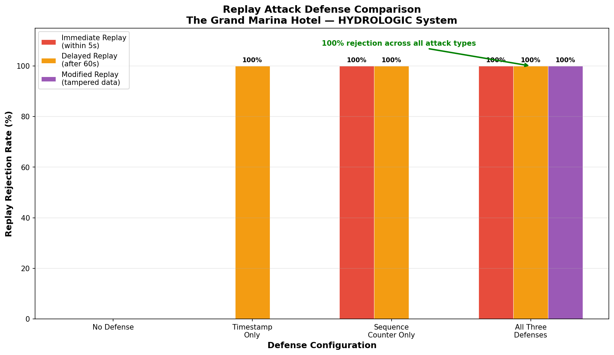

# MQTT Replay Attack Defense – Hydroficient Project 6

## Overview
This project demonstrates how replay attacks can affect IoT messaging systems and how layered defenses can prevent them. The system simulates water flow sensors publishing data through an MQTT pipeline and evaluates different replay attack defenses.

The project builds on earlier work where TLS and mutual TLS secured the connection between devices and the broker. In this stage, we focus on protecting the integrity and freshness of messages themselves.

## The Problem
Even when TLS encrypts traffic and authenticates devices, attackers can still capture legitimate messages and replay them later.

This can cause incorrect system behavior such as:
- false shutdown signals
- incorrect sensor readings
- repeated commands

Replay attacks are a known threat in IoT environments where messages are transmitted frequently and systems rely on real-time data.

## Defense Mechanisms Implemented
Three layered defenses were implemented in the subscriber.

### 1. Timestamp Validation
Rejects messages that are older than an allowed time window.

Purpose:
- Prevents delayed replay attacks.

### 2. Sequence Counters
Each device sends messages with incrementing sequence numbers.

Purpose:
- Detects duplicate messages.
- Blocks immediate replay attacks.

### 3. HMAC Message Signing
Messages include a cryptographic signature generated with a shared secret.

Purpose:
- Detects message tampering.
- Prevents modified replay attacks.

## Experiment Design
Four defense configurations were tested against three attack types.

Defense configurations:
- No defense
- Timestamp validation only
- Sequence counter only
- All defenses combined

Attack types:
- Immediate replay
- Delayed replay
- Modified replay (tampered sensor value)

Each experiment processed five messages and measured the rejection rate.

## Results

| Defense | Immediate Replay | Delayed Replay | Modified Replay |
|---|---:|---:|---:|
| No defense | 0% | 0% | 0% |
| Timestamp only | 0% | 100% | 0% |
| Counter only | 100% | 100% | 0% |
| All defenses | 100% | 100% | 100% |

The results show that no single defense covers all attack types, but combining all three provides complete protection.

## Defense Comparison Chart

## Files

### Core Scripts
- [publisher_defended.py](./publisher_defended.py)
- [subscriber_defended.py](./subscriber_defended.py)
- [replay_attacker.py](./replay_attacker.py)
- [defense_tester.py](./defense_tester.py)

### Experiment Results
- [experiment_results.json](./experiment_results.json)
- [captured_messages.json](./captured_messages.json)
- [defense_comparison.png](./defense_comparison.png)

### Screenshots:
- [Defense experiment screenshots](./screenshots-defense-experiments)
- [Replay attack screenshots](./screenshots-replay-attack)

## Key Takeaways
- TLS protects communication channels but does not prevent replay attacks.
- Replay protection requires message-level validation.
- Layered defenses provide stronger protection than individual controls.
- The performance overhead of all three checks is negligible (less than 1 ms per message).

## Next Step
The next stage of the project is building a real-time security dashboard that visualizes accepted and rejected messages and alerts operators when attacks occur.
